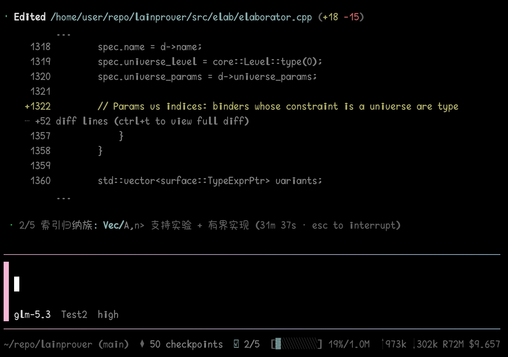
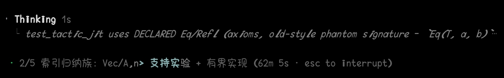

# @NekoSekaiMoe/pi-ui

A Codex-style reskin for the interactive TUI of the [Pi coding agent](https://github.com/earendil-works/pi-coding-agent).

`pi-ui` changes presentation, not agent behavior: model calls, tool execution, session history, todo management, and subagent scheduling remain owned by Pi and their original extensions.

## Screenshots





## Highlights

- **Open gradient editor** with pink-to-cyan rules, a left accent, and an embedded model/provider/thinking row.
- **Compact footer** that preserves extension statuses and displays Git branch, context usage, token totals, cache usage, and cost.
- **Animated working state** with an omp-style theme-color shimmer sweep (dim → muted → accent, bold crest), elapsed time, retry/compaction styling, and a persistent `Worked for Ns` transcript entry.
- **Todo integration** that mirrors the active plan step into the working line and suppresses the duplicate todo widget.
- **Flat subagent widget** that turns `pi-subagents` async-job trees into compact status rows.
- **Flat tool rendering** for built-in, extension, MCP, and future tools without replacing their execution logic.
- **Codex-style thinking rows**: while reasoning streams, only a `Thinking:` header plus the current tail line is shown; once the run closes it becomes `Thought for Ns` plus a one-sentence summary written by the model itself, with ctrl+t expanding the full text.

## Installation

```bash
pi install npm:@NekoSekaiMoe/pi-ui
```

For local development from this package directory:

```bash
pi -e ./src/index.ts
```

There are no commands or configuration files. The reskin activates when the extension loads.

## Mode scope

All visual setup is gated to interactive TUI sessions. In `rpc`, `print`, and `json` modes, Pi's default output remains in use.

## What changes

### Gradient editor

The custom editor keeps Pi's normal editing, cursor, autocomplete, and keybinding behavior while changing the frame and metadata row. It also tracks `!`-prefixed shell mode for the footer and bypasses the custom shortcut layer during multi-line paste so pasted newlines are not accidentally submitted.

### Usage footer

The footer combines left- and right-aligned data in one terminal row:

- extension statuses, sorted by key;
- the current Git branch;
- context-window usage and capacity;
- cumulative input, output, and cache tokens from assistant messages on the active branch; and
- cumulative reported cost.

Context usage changes color at approximately 70% and 90%. Values come from Pi's session and usage APIs; the extension does not estimate model pricing itself.

### Working shimmer and elapsed entries

On `agent_start`, the extension starts a ~30 fps animation timer and sweeps a cosine band across Pi's working message using theme colors, matching omp's classic shimmer. On `agent_settled`, it stops the timer, clears the message, and appends a `pi-ui-elapsed` entry such as:

```text
Worked for 12s
```

Retry countdowns and context compaction are styled through a guarded `Loader.updateDisplay` hook while retaining the underlying status text.

### Todo integration

When a todo tool result contains the expected `details.todos` structure, `pi-ui` mirrors the in-progress—or next pending—step into the working line:

```text
1/3 · run typecheck (9s · esc to interrupt)
```

The todo extension remains responsible for plan state. `pi-ui` only observes tool results and presentation. It intercepts `setWidget("todo", ...)` and clears that widget to avoid showing the same plan twice. If the todo result shape changes, the working line falls back to the generic label without affecting task execution.

### Subagent widget skin

Writes to the `subagent-async` widget are wrapped and re-rendered as flat rows, for example:

```text
● parallel · 2 agents running · 0/2 done · 25 tool uses · 37k token · 43.6s
  └ Agent 1/2: worker · running · 14 tool uses · 20k token
  └ Agent 2/2: worker · running · 11 tool uses · 17k token
```

The wrapper preserves the original component's invalidation and disposal behavior. Unknown future line shapes degrade to dim continuation rows. Job creation, tracking, cancellation, and result handling continue to live in `pi-subagents`.

### Collapsed thinking rows

Assistant thinking runs no longer stream their full italic markdown. They render as flat tool-style rows — a dot plus a bold verb and a `└` continuation — so thinking reads like any other tool activity. While a run is still growing, the transcript shows the elapsed seconds plus exactly the most recent reasoning line, re-truncated to the terminal width on every render:

```text
• Thinking 4s
  └ The user wants a Codex-style thinking display, so first I need to patch…
```

When the run closes (the model moved on to text or tool calls, or the message finished), it collapses to the observed duration plus a one-sentence summary of the reasoning, written by the model itself:

```text
• Thought for 12s
  └ I'll patch AssistantMessageComponent to render collapsed thinking rows.
```

The summary sentence is generated by the model itself: when a live run closes, `pi-ui` makes one nested `completeSimple` call (reasoning at the minimum level, ≤256 output tokens, input bounded to the head and tail of the trace) asking the current model to condense its reasoning into a single sentence in the reasoning's own language. Until the sentence lands — typically one to two seconds — the run's last line, usually the model's own conclusion, stands in and is then replaced in place via an immediate repaint. Short runs (≤2 lines), failed calls, and messages restored from disk skip the call and keep the last-line fallback; a bare `Thought` header marks runs without live timing. Like `pi-smart-flow`'s compact-thinking, summaries are display-only: the assistant message and its thinking signatures are never modified, so nothing is sent back to the provider.

`ctrl+t` toggles between this collapsed pair and Pi's full thinking markdown for every message in the transcript. Pi emits a fresh shallow copy of the partial assistant message on every stream delta, so durations are accumulated per run position while the message streams and committed onto the finalized message object at `message_end`; both durations and summaries therefore survive ctrl+t rebuilds. Messages restored from disk have no live timing and show a bare `• Thought` header with the last-line fallback. The "Hide thinking" entry is removed from `/settings` because the collapsed/expanded pair supersedes both of its states.

Text blocks, spacing, stop-reason/error rows, markdown transformers (Mermaid and friends), and messages without thinking keep Pi's exact rendering; `AssistantMessageComponent.updateContent` is re-implemented only for thinking-bearing messages and falls back to the original on any unexpected shape.

### Flat tool rows

Tool activity is normalized into compact call/result rows:

```text
• Running rg --files
• Ran rg --files
  └ 42 lines
```

For `bash`, `read`, `edit`, `write`, and `ls`, the package creates the normal Pi tool definitions, spreads their original schema and execution behavior, and replaces only rendering-related fields. `write` captures previous file contents so it can display a diff similar to `edit`.

`grep`, `find`, and tools registered by other extensions are handled through renderer-lookup redirects on `ToolExecutionComponent`. This preserves the owning extension's parameters and `execute()` implementation regardless of load order. Known tools receive tailored verbs such as `Searched` or `Fetched`; unknown tools receive a generic label derived from common arguments or compact JSON.

Long shell output uses a collapsed preview. Edit and write results retain added/removed totals and can be expanded with Pi's normal tool-detail shortcut.

## Architecture

| Module | Responsibility | Main integration point |
| --- | --- | --- |
| `src/index.ts` | One-time renderer setup and per-session TUI wiring | Pi lifecycle events |
| `src/editor.ts` | Gradient frame, input handling, and model toolbar | `ctx.ui.setEditorComponent()` |
| `src/footer.ts` | Status, branch, context, token, and cost footer | `ctx.ui.setFooter()` |
| `src/working.ts` | Working animation, todo mirroring, elapsed entries | agent/tool events and working UI methods |
| `src/thinking.ts` | Codex-style collapsed thinking rows, ctrl+t expansion, settings entry removal | `AssistantMessageComponent`/`InteractiveMode`/`SettingsList` prototype patches |
| `src/tools.ts` | Built-in definitions and external renderer redirects | `pi.registerTool()` and TUI internals |
| `src/subagent-widget.ts` | Flat `pi-subagents` widget adapter | `ctx.ui.setWidget()` wrapper |
| `src/gradient.ts` | ANSI truecolor interpolation helpers | Terminal rendering |
| `src/state.ts` | Shared editor/footer shell-mode state | Internal state |

One-time event handlers are installed when the extension loads so session switches do not accumulate timers or listeners. Editor, footer, shell renderer, and widget wrappers are applied on each TUI `session_start` because those APIs replace session-local components.

The external tool-renderer redirect intentionally remains installed for the process lifetime so `/new`, `/resume`, and forks do not silently restore bordered rows. The shell renderer is restored on `session_shutdown` before it is installed for a later session.

## Version coupling

The editor, footer, normal working state, and elapsed entry use supported extension APIs. Some presentation features depend on implementation details that are not part of Pi's stable extension contract:

- exported `create<Tool>ToolDefinition(cwd)` factories;
- private renderer lookup methods on `ToolExecutionComponent`;
- `AssistantMessageComponent.updateContent`, `InteractiveMode.toggleThinkingBlockVisibility`, and `SettingsList.render` internals for the thinking display;
- `Loader.updateDisplay`;
- `ToolRenderContext` state flags; and
- the textual widget format and key emitted by `pi-subagents`.

The repository is currently aligned with Pi/TUI/core `0.84.1` (pinned via `resolutions` in the root `package.json`; bump them together). Internal hooks are guarded with shape checks and `try`/`catch`; incompatible versions should generally fall back to default or reduced rendering rather than prevent Pi from starting. Partial visual mismatches after a Pi or `pi-subagents` upgrade are still possible.

## Limitations

- The generic user-message marker and arbitrary assistant prose cannot be fully reskinned through the public UI API.
- Gradients require a truecolor-capable terminal. Text remains usable when colors are reduced.
- Very narrow terminals may truncate footer data and tool summaries.
- Another extension that replaces the editor, footer, shared theme methods, widgets, or renderer hooks can affect the final result; extension load order may determine which visual override wins.
- Todo and subagent integrations are display adapters, not compatibility guarantees for every future output format.

## Troubleshooting

If Pi starts but some rows retain their default style, first verify the Pi version and the version of the extension that owns the affected tool or widget. A guarded internal hook may have declined to patch an unfamiliar shape. The underlying tool should continue to work; the symptom is normally presentational.

To compare behavior without the reskin, remove or disable `pi-ui` and restart Pi. Because some renderer changes are process-lifetime, unloading it inside an existing process is not equivalent to a fresh restart.

## License

BSD-2-Clause.
